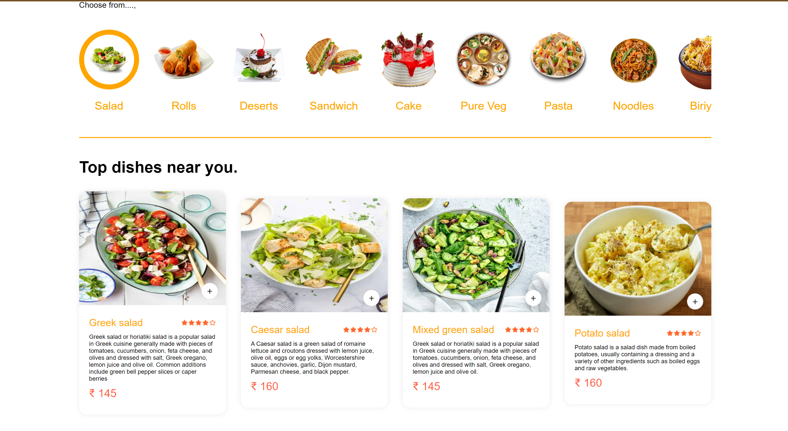
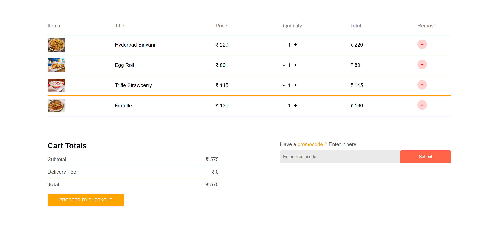
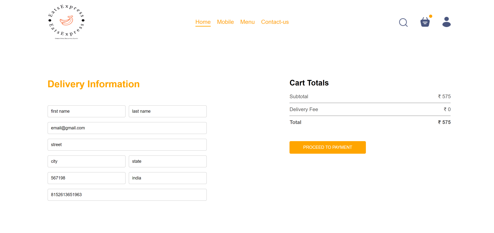
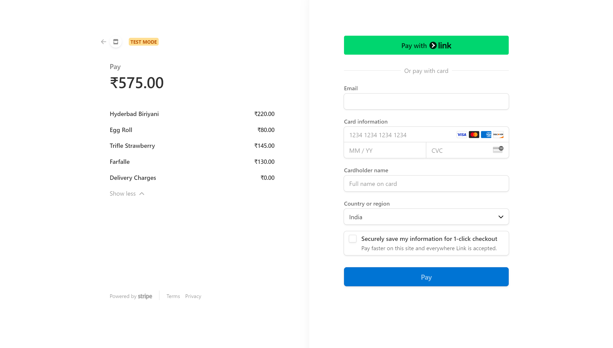
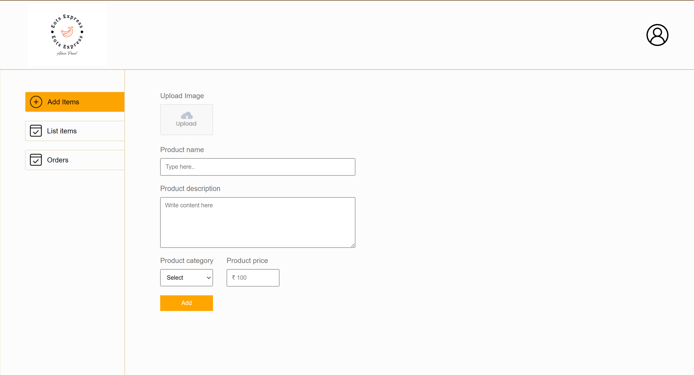

# Eats Express Food Delivery App

Eats Express is a food delivery application designed to connect users with local restaurants for quick and convenient food delivery. This app is built using the MERN stack (MongoDB, Express, React, Node.js) and includes a comprehensive admin panel for managing restaurants, orders, and users.

## Table of Contents

- [Features](#features)
- [Screenshots](#screenshots)
- [Demo](#demo)
- [Installation](#installation)
- [Usage](#usage)
- [API Endpoints](#api-endpoints)
- [Technologies](#technologies)
- [Contributing](#contributing)
- [License](#license)
- [Contact](#contact)

## Features

- **User Registration and Authentication**: Sign up, login, and manage user profiles.
- **Restaurant Management**: Admins can add, edit, and delete restaurant details.
- **Menu Management**: Admins can manage menu items.
- **Order Management**: Users can place orders, and admins can manage order statuses.
- **Responsive Design**: Optimized for both desktop and mobile devices.
- **Real-time Notifications**: Get real-time updates on order status.

## Screenshots

<!-- Include screenshots of the app -->












## Installation

To get a local copy up and running, follow these steps:

### Prerequisites

- Node.js
- MongoDB

### Clone the repository

```bash
git clone https://github.com/your-username/eats-express.git
cd eats-express
```
